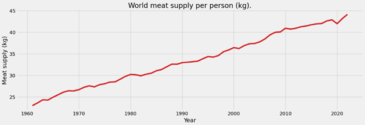
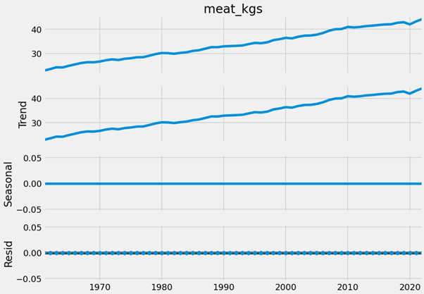
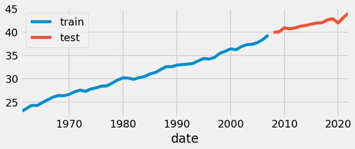
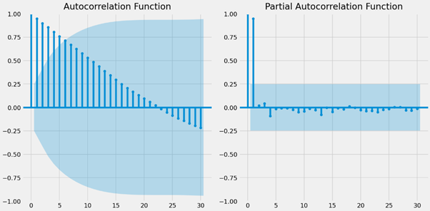
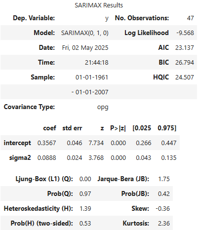
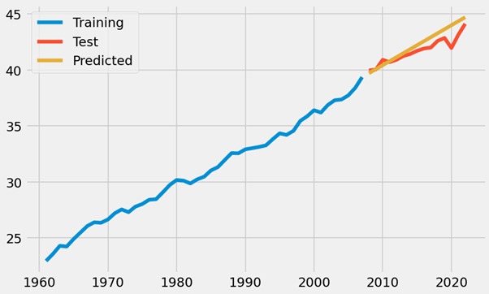

# Project background

I am very passionate about the environment and what we as humans can do to protect it. Research has shown that following a vegan diet causes less harm to the planet than a traditional meat and dairy-based diet, due to various factors such as less land space required for raising animals, less water required for processing meat and dairy, fewer CO2 emissions, etc. Studies have also shown an increase in the number of people globally following a vegan diet, which would lead to less harm to the environment should this trend continue. An increase in 'veganism' would suggest a decrease in the meat supply required given that fewer people are eating meat. But can this be predicted? This project will explore the hypothesis: 

### "Global meat supply has decreased over time with the increased prevalence of those following vegan diets, and future meat supply levels can be predicted to understand the potential impacts on the environment"

Being able to predict the meat supply required would lead to better comprehension of the harmful effects caused by raising and eating meat, and therefore better understanding of what state of the environment would be in after a certain amount of time.

## The Data

The data is collected by the Food and Agricutlure Organization of the United Nations - https://www.fao.org/faostat/en/#data/FBS , and processed by Our World in Data - https://ourworldindata.org/meat-production . Data of the meat supply by country from 1961 to 2022 is downloaded as an Excel file ready to be read into Python, and the value for the 'World' is selected as the data point for this analysis - individual countries are discarded.

The dataset consists of the meat supply globally in kgs per person per capita, plus the year in which that value is seen. The aim of this project is to build a time-series predictive model within Python with the intention of being able to predict future values of meat supply. 

## Exploratory Data Analysis

Figure 1 visualises the meat supply by year:

 
*Figure 1*

It is clear to see from this graph that global supply has increased continually over time, aside from the dip in 2020 which can be assumed is as due to the COVID-19 pandemic. But is it possible to build a model that can predict the future supply...?

## The Analysis

We wouldn't expect any seasonal element to this model as the data is annual-only, but Figure 2 verifies this with a visual:


*Figure 2*

  
The data is split into a train and test set - there are 62 years in the dataset i.e. 62 data points, and the last 15 are chosen to be the test set. Figure 3 demonstrates the split:


*Figure 3*
\
\
Figure 4 shows the plots of the autocorrelation and partial autocorrelation functions:


*Figure 4*

It again verifies a non-seasonal series due to the lack of 'wave' pattern in the lags, and is statistically significant at lag 5. The spikes at lag 1 and 2 in the PACF plot suggest these values should be used within the model parameters.
\
\
The **auto_arima** Python function is used to build an ARIMA model by testing combinations of parameters to find the best set of *(p, d, q)*, and when run gives the following output:


\
\
Figure 5 visualises the predicted vs the actual meat supply


*Figure 5*
\
\
The model outputs an R<sup>2</sup> score of ``` 0.507953929116781 ``` and an MAPE value of ``` 3.8039852254260493 ``` indicating that the predicted values are within 3% of the actual values.


## The conclusion...
That's a not-bad figure for R<sup>2</sup>, however the feeling among data scientists is generall that it is not a good metric for analysing the fit of a non-stationary time series - it's possible that a hig value is purely due to the higher variance that comes with non-stationarity rather than the measure of low error that it is supposed to be. So that isn't much use to us here. The MAPE value of 3% again looks pretty great, however it's clear from the line graph in Figure 5 that the model has struggled to adapt to the drop in meat supply in 2020, which doesn't fill one with confidence that it would be able to ebb and flow with future rises and falls.
Those AIC and BIC values are nice and low, and the p-value is **well** below the statistically-significant threshold. However...

I think the overarching issue here is that there just aren't enough data points yet. Usually a time series would be looking at monthly or even daily data in which there would be more than likely be massive ebbs and flows of trends, and that number of observations over several years would end up with a huge dataset that a training model can really sink its teeth into. And that just isn't the case here - between 1961 and 2022 there are only 62 data points, which isn't sufficient for a model to properly train on and use to accurately predict.

There is only 'increase' in this data - the meat supply only increases, which realistically is expected anyway between these two timeframes as global population expanded. However there is no 'decrease' for the model to pick up on and train with, which gives no accountability of the fact that meat supply may yet start to drop as we realise we need to eat less of it.

I would recommend that this experiment be repeated in several decades or later, as it would be interesting to analyse what the data looks like if the number of those following vegan diets does indeed increase...
It would also be interesting to build a predictive model that includes all of the countries in the original dataset. It is possible that there are more fluctiations year-on-year among certain countries, and if a model were deemed accurate enough then it could be used as a method to determine where should be targeted for meat reducing initiatives.


